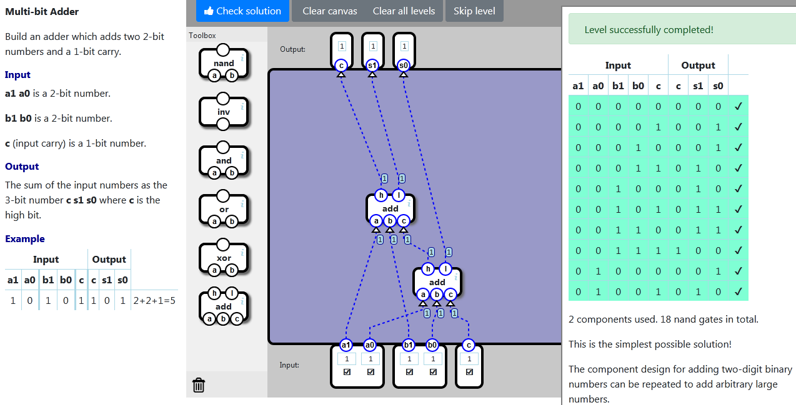

    localStorage["NandGame:Levels:ADD2"]="{\"nodes\":[{\"type\":\"ADDC\",\"x\":232,\"y\":385,\"id\":\"0\"},{\"type\":\"ADDC\",\"x\":157,\"y\":267,\"id\":\"1\"}],\"connections\":[{\"source\":{\"nodeId\":\"input\",\"connectorId\":\"1\"},\"target\":{\"nodeId\":\"0\",\"connectorId\":\"0\"}},{\"source\":{\"nodeId\":\"input\",\"connectorId\":\"3\"},\"target\":{\"nodeId\":\"0\",\"connectorId\":\"1\"}},{\"source\":{\"nodeId\":\"input\",\"connectorId\":\"4\"},\"target\":{\"nodeId\":\"0\",\"connectorId\":\"2\"}},{\"source\":{\"nodeId\":\"input\",\"connectorId\":\"0\"},\"target\":{\"nodeId\":\"1\",\"connectorId\":\"0\"}},{\"source\":{\"nodeId\":\"input\",\"connectorId\":\"2\"},\"target\":{\"nodeId\":\"1\",\"connectorId\":\"1\"}},{\"source\":{\"nodeId\":\"0\",\"connectorId\":\"0\"},\"target\":{\"nodeId\":\"1\",\"connectorId\":\"2\"}},{\"source\":{\"nodeId\":\"1\",\"connectorId\":\"0\"},\"target\":{\"nodeId\":\"output\",\"connectorId\":\"0\"}},{\"source\":{\"nodeId\":\"1\",\"connectorId\":\"1\"},\"target\":{\"nodeId\":\"output\",\"connectorId\":\"1\"}},{\"source\":{\"nodeId\":\"0\",\"connectorId\":\"1\"},\"target\":{\"nodeId\":\"output\",\"connectorId\":\"2\"}}]}"

