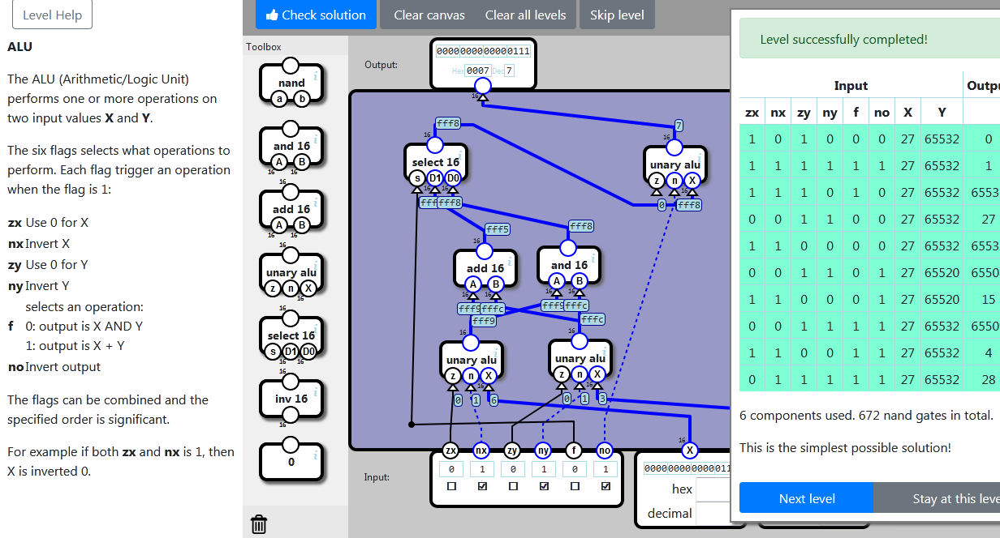

    localStorage["NandGame:Levels:ALU"]="{\"nodes\":[{\"type\":\"ALU_PRESET\",\"x\":112,\"y\":376,\"id\":\"0\"},{\"type\":\"ALU_PRESET\",\"x\":246,\"y\":374,\"id\":\"1\"},{\"type\":\"SELECT16\",\"x\":68,\"y\":132,\"id\":\"2\"},{\"type\":\"AND16\",\"x\":232,\"y\":259,\"id\":\"3\"},{\"type\":\"ADD16\",\"x\":129,\"y\":263,\"id\":\"4\"},{\"type\":\"ALU_PRESET\",\"x\":363,\"y\":135,\"id\":\"5\"}],\"connections\":[{\"source\":{\"nodeId\":\"input\",\"connectorId\":\"0\"},\"target\":{\"nodeId\":\"0\",\"connectorId\":\"0\"}},{\"source\":{\"nodeId\":\"input\",\"connectorId\":\"1\"},\"target\":{\"nodeId\":\"0\",\"connectorId\":\"1\"}},{\"source\":{\"nodeId\":\"input\",\"connectorId\":\"6\"},\"target\":{\"nodeId\":\"0\",\"connectorId\":\"2\"}},{\"source\":{\"nodeId\":\"input\",\"connectorId\":\"2\"},\"target\":{\"nodeId\":\"1\",\"connectorId\":\"0\"}},{\"source\":{\"nodeId\":\"input\",\"connectorId\":\"3\"},\"target\":{\"nodeId\":\"1\",\"connectorId\":\"1\"}},{\"source\":{\"nodeId\":\"input\",\"connectorId\":\"7\"},\"target\":{\"nodeId\":\"1\",\"connectorId\":\"2\"}},{\"source\":{\"nodeId\":\"input\",\"connectorId\":\"4\"},\"target\":{\"nodeId\":\"2\",\"connectorId\":\"0\"},\"points\":[{\"x\":78,\"y\":480}]},{\"source\":{\"nodeId\":\"4\",\"connectorId\":\"0\"},\"target\":{\"nodeId\":\"2\",\"connectorId\":\"1\"}},{\"source\":{\"nodeId\":\"3\",\"connectorId\":\"0\"},\"target\":{\"nodeId\":\"2\",\"connectorId\":\"2\"}},{\"source\":{\"nodeId\":\"0\",\"connectorId\":\"0\"},\"target\":{\"nodeId\":\"3\",\"connectorId\":\"0\"}},{\"source\":{\"nodeId\":\"1\",\"connectorId\":\"0\"},\"target\":{\"nodeId\":\"3\",\"connectorId\":\"1\"}},{\"source\":{\"nodeId\":\"0\",\"connectorId\":\"0\"},\"target\":{\"nodeId\":\"4\",\"connectorId\":\"0\"}},{\"source\":{\"nodeId\":\"1\",\"connectorId\":\"0\"},\"target\":{\"nodeId\":\"4\",\"connectorId\":\"1\"}},{\"source\":{\"nodeId\":\"input\",\"connectorId\":\"5\"},\"target\":{\"nodeId\":\"5\",\"connectorId\":\"1\"}},{\"source\":{\"nodeId\":\"2\",\"connectorId\":\"0\"},\"target\":{\"nodeId\":\"5\",\"connectorId\":\"2\"}},{\"source\":{\"nodeId\":\"5\",\"connectorId\":\"0\"},\"target\":{\"nodeId\":\"output\",\"connectorId\":\"0\"}}]}"

