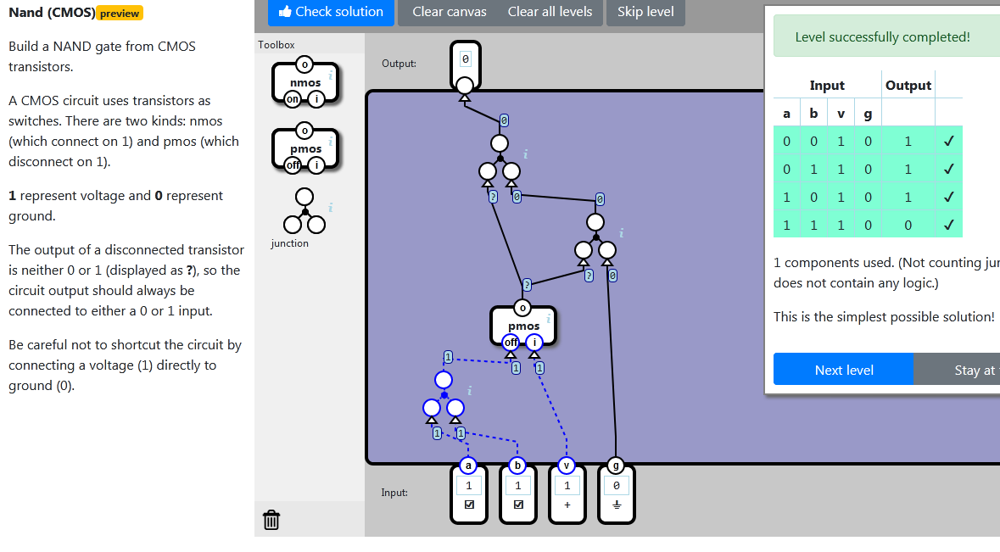

    localStorage["NandGame:Levels:CMOS_NAND"]="{\"nodes\":[{\"type\":\"TRINARY_LOGIC_WIRE_JUNCTION\",\"x\":54,\"y\":406,\"id\":\"0\"},{\"type\":\"PMOS\",\"x\":147,\"y\":321,\"id\":\"1\"},{\"type\":\"TRINARY_LOGIC_WIRE_JUNCTION\",\"x\":233,\"y\":220,\"id\":\"2\"},{\"type\":\"TRINARY_LOGIC_WIRE_JUNCTION\",\"x\":120,\"y\":127,\"id\":\"3\"}],\"connections\":[{\"source\":{\"nodeId\":\"input\",\"connectorId\":\"0\"},\"target\":{\"nodeId\":\"0\",\"connectorId\":\"0\"}},{\"source\":{\"nodeId\":\"input\",\"connectorId\":\"1\"},\"target\":{\"nodeId\":\"0\",\"connectorId\":\"1\"}},{\"source\":{\"nodeId\":\"0\",\"connectorId\":\"0\"},\"target\":{\"nodeId\":\"1\",\"connectorId\":\"0\"}},{\"source\":{\"nodeId\":\"input\",\"connectorId\":\"2\"},\"target\":{\"nodeId\":\"1\",\"connectorId\":\"1\"}},{\"source\":{\"nodeId\":\"1\",\"connectorId\":\"0\"},\"target\":{\"nodeId\":\"2\",\"connectorId\":\"0\"}},{\"source\":{\"nodeId\":\"input\",\"connectorId\":\"3\"},\"target\":{\"nodeId\":\"2\",\"connectorId\":\"1\"}},{\"source\":{\"nodeId\":\"1\",\"connectorId\":\"0\"},\"target\":{\"nodeId\":\"3\",\"connectorId\":\"0\"}},{\"source\":{\"nodeId\":\"2\",\"connectorId\":\"0\"},\"target\":{\"nodeId\":\"3\",\"connectorId\":\"1\"}},{\"source\":{\"nodeId\":\"3\",\"connectorId\":\"0\"},\"target\":{\"nodeId\":\"output\",\"connectorId\":\"0\"}}]}"

