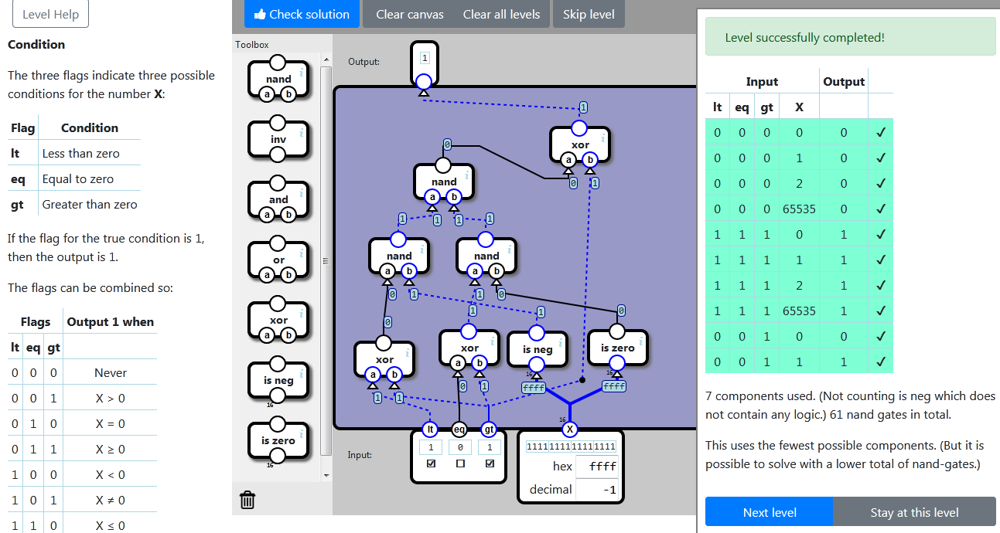

    localStorage["NandGame:Levels:CONDITION"]="{\"nodes\":[{\"type\":\"ISNEG\",\"x\":225,\"y\":384,\"id\":\"0\"},{\"type\":\"ISZERO\",\"x\":329,\"y\":382,\"id\":\"1\"},{\"type\":\"XOR\",\"x\":27,\"y\":397,\"id\":\"2\"},{\"type\":\"XOR\",\"x\":137,\"y\":382,\"id\":\"3\"},{\"type\":\"NAND\",\"x\":46,\"y\":263,\"id\":\"4\"},{\"type\":\"NAND\",\"x\":159,\"y\":263,\"id\":\"5\"},{\"type\":\"NAND\",\"x\":104,\"y\":167,\"id\":\"6\"},{\"type\":\"XOR\",\"x\":280,\"y\":119,\"id\":\"7\"}],\"connections\":[{\"source\":{\"nodeId\":\"input\",\"connectorId\":\"3\"},\"target\":{\"nodeId\":\"0\",\"connectorId\":\"0\"}},{\"source\":{\"nodeId\":\"input\",\"connectorId\":\"3\"},\"target\":{\"nodeId\":\"1\",\"connectorId\":\"0\"}},{\"source\":{\"nodeId\":\"input\",\"connectorId\":\"0\"},\"target\":{\"nodeId\":\"2\",\"connectorId\":\"0\"}},{\"source\":{\"nodeId\":\"input\",\"connectorId\":\"2\"},\"target\":{\"nodeId\":\"2\",\"connectorId\":\"1\"}},{\"source\":{\"nodeId\":\"input\",\"connectorId\":\"1\"},\"target\":{\"nodeId\":\"3\",\"connectorId\":\"0\"}},{\"source\":{\"nodeId\":\"input\",\"connectorId\":\"2\"},\"target\":{\"nodeId\":\"3\",\"connectorId\":\"1\"}},{\"source\":{\"nodeId\":\"2\",\"connectorId\":\"0\"},\"target\":{\"nodeId\":\"4\",\"connectorId\":\"0\"}},{\"source\":{\"nodeId\":\"0\",\"connectorId\":\"0\"},\"target\":{\"nodeId\":\"4\",\"connectorId\":\"1\"}},{\"source\":{\"nodeId\":\"3\",\"connectorId\":\"0\"},\"target\":{\"nodeId\":\"5\",\"connectorId\":\"0\"}},{\"source\":{\"nodeId\":\"1\",\"connectorId\":\"0\"},\"target\":{\"nodeId\":\"5\",\"connectorId\":\"1\"}},{\"source\":{\"nodeId\":\"4\",\"connectorId\":\"0\"},\"target\":{\"nodeId\":\"6\",\"connectorId\":\"0\"}},{\"source\":{\"nodeId\":\"5\",\"connectorId\":\"0\"},\"target\":{\"nodeId\":\"6\",\"connectorId\":\"1\"}},{\"source\":{\"nodeId\":\"6\",\"connectorId\":\"0\"},\"target\":{\"nodeId\":\"7\",\"connectorId\":\"0\"}},{\"source\":{\"nodeId\":\"input\",\"connectorId\":\"2\"},\"target\":{\"nodeId\":\"7\",\"connectorId\":\"1\"},\"points\":[{\"x\":323,\"y\":448}]},{\"source\":{\"nodeId\":\"7\",\"connectorId\":\"0\"},\"target\":{\"nodeId\":\"output\",\"connectorId\":\"0\"}}]}"

