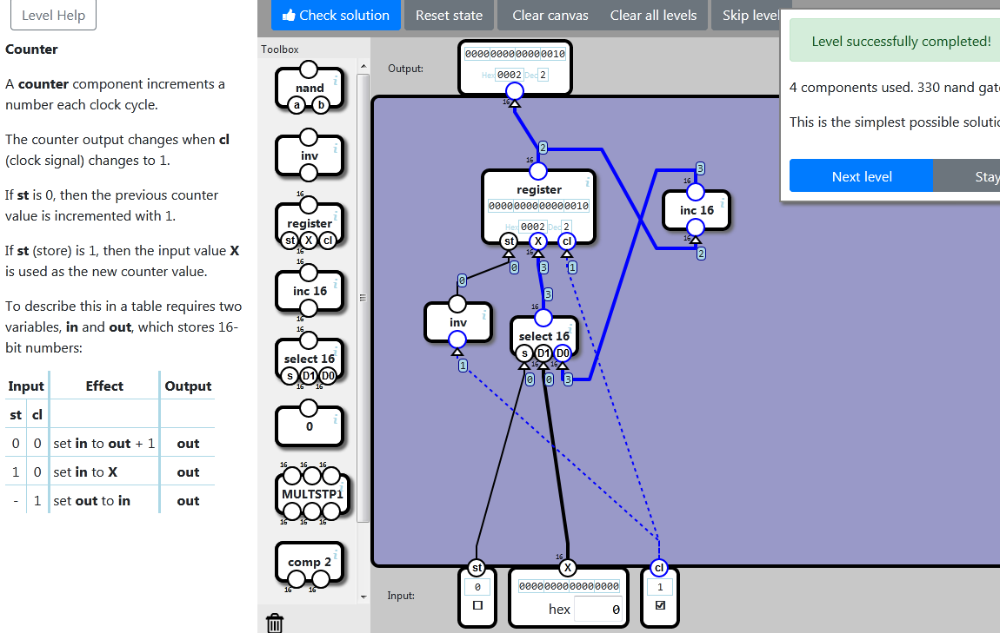

    localStorage["NandGame:Levels:COUNTER"]="{\"nodes\":[{\"type\":\"SELECT16\",\"x\":160,\"y\":320,\"id\":\"0\"},{\"type\":\"DFF16\",\"x\":127,\"y\":151,\"id\":\"1\"},{\"type\":\"INV\",\"x\":61,\"y\":304,\"id\":\"2\"},{\"type\":\"INC16\",\"x\":335,\"y\":175,\"id\":\"3\"}],\"connections\":[{\"source\":{\"nodeId\":\"input\",\"connectorId\":\"0\"},\"target\":{\"nodeId\":\"0\",\"connectorId\":\"0\"}},{\"source\":{\"nodeId\":\"input\",\"connectorId\":\"1\"},\"target\":{\"nodeId\":\"0\",\"connectorId\":\"1\"}},{\"source\":{\"nodeId\":\"3\",\"connectorId\":\"0\"},\"target\":{\"nodeId\":\"0\",\"connectorId\":\"2\"}},{\"source\":{\"nodeId\":\"2\",\"connectorId\":\"0\"},\"target\":{\"nodeId\":\"1\",\"connectorId\":\"0\"}},{\"source\":{\"nodeId\":\"0\",\"connectorId\":\"0\"},\"target\":{\"nodeId\":\"1\",\"connectorId\":\"1\"}},{\"source\":{\"nodeId\":\"input\",\"connectorId\":\"2\"},\"target\":{\"nodeId\":\"1\",\"connectorId\":\"2\"}},{\"source\":{\"nodeId\":\"input\",\"connectorId\":\"2\"},\"target\":{\"nodeId\":\"2\",\"connectorId\":\"0\"}},{\"source\":{\"nodeId\":\"1\",\"connectorId\":\"0\"},\"target\":{\"nodeId\":\"3\",\"connectorId\":\"0\"}},{\"source\":{\"nodeId\":\"1\",\"connectorId\":\"0\"},\"target\":{\"nodeId\":\"output\",\"connectorId\":\"0\"}}]}"

