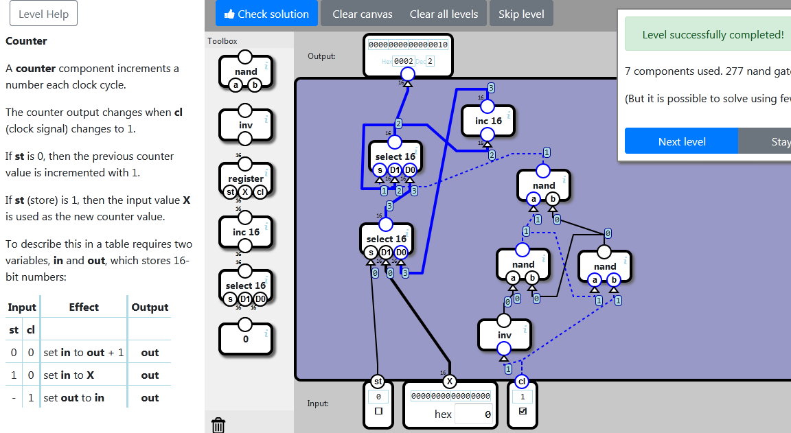

    localStorage["NandGame:Levels:COUNTER"]="{\"nodes\":[{\"type\":\"NAND\",\"x\":294,\"y\":315,\"id\":\"0\"},{\"type\":\"NAND\",\"x\":413,\"y\":318,\"id\":\"1\"},{\"type\":\"INV\",\"x\":267,\"y\":418,\"id\":\"2\"},{\"type\":\"NAND\",\"x\":324,\"y\":200,\"id\":\"3\"},{\"type\":\"SELECT16\",\"x\":108,\"y\":158,\"id\":\"4\"},{\"type\":\"SELECT16\",\"x\":95,\"y\":278,\"id\":\"5\"},{\"type\":\"INC16\",\"x\":243,\"y\":106,\"id\":\"6\"}],\"connections\":[{\"source\":{\"nodeId\":\"2\",\"connectorId\":\"0\"},\"target\":{\"nodeId\":\"0\",\"connectorId\":\"0\"}},{\"source\":{\"nodeId\":\"1\",\"connectorId\":\"0\"},\"target\":{\"nodeId\":\"0\",\"connectorId\":\"1\"}},{\"source\":{\"nodeId\":\"0\",\"connectorId\":\"0\"},\"target\":{\"nodeId\":\"1\",\"connectorId\":\"0\"}},{\"source\":{\"nodeId\":\"input\",\"connectorId\":\"2\"},\"target\":{\"nodeId\":\"1\",\"connectorId\":\"1\"}},{\"source\":{\"nodeId\":\"input\",\"connectorId\":\"2\"},\"target\":{\"nodeId\":\"2\",\"connectorId\":\"0\"}},{\"source\":{\"nodeId\":\"0\",\"connectorId\":\"0\"},\"target\":{\"nodeId\":\"3\",\"connectorId\":\"0\"}},{\"source\":{\"nodeId\":\"1\",\"connectorId\":\"0\"},\"target\":{\"nodeId\":\"3\",\"connectorId\":\"1\"}},{\"source\":{\"nodeId\":\"3\",\"connectorId\":\"0\"},\"target\":{\"nodeId\":\"4\",\"connectorId\":\"0\"}},{\"source\":{\"nodeId\":\"4\",\"connectorId\":\"0\"},\"target\":{\"nodeId\":\"4\",\"connectorId\":\"1\"}},{\"source\":{\"nodeId\":\"5\",\"connectorId\":\"0\"},\"target\":{\"nodeId\":\"4\",\"connectorId\":\"2\"}},{\"source\":{\"nodeId\":\"input\",\"connectorId\":\"0\"},\"target\":{\"nodeId\":\"5\",\"connectorId\":\"0\"}},{\"source\":{\"nodeId\":\"input\",\"connectorId\":\"1\"},\"target\":{\"nodeId\":\"5\",\"connectorId\":\"1\"}},{\"source\":{\"nodeId\":\"6\",\"connectorId\":\"0\"},\"target\":{\"nodeId\":\"5\",\"connectorId\":\"2\"}},{\"source\":{\"nodeId\":\"4\",\"connectorId\":\"0\"},\"target\":{\"nodeId\":\"6\",\"connectorId\":\"0\"}},{\"source\":{\"nodeId\":\"4\",\"connectorId\":\"0\"},\"target\":{\"nodeId\":\"output\",\"connectorId\":\"0\"}}]}"

