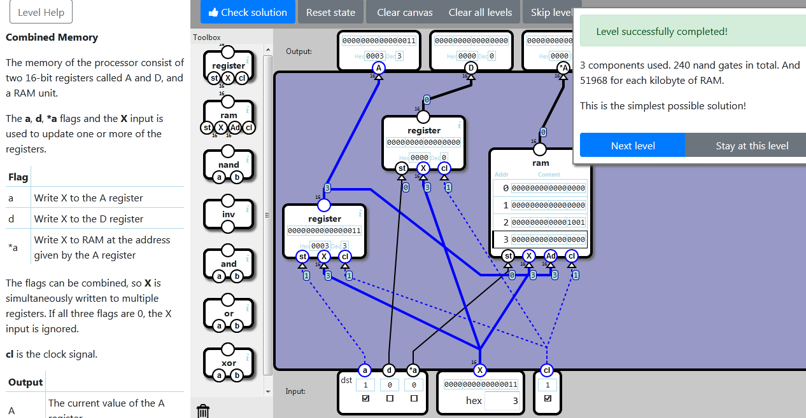

    localStorage["NandGame:Levels:CPU_STATE"]="{\"nodes\":[{\"type\":\"RAM\",\"x\":338,\"y\":187,\"id\":\"0\"},{\"type\":\"DFF16\",\"x\":14,\"y\":275,\"id\":\"1\"},{\"type\":\"DFF16\",\"x\":170,\"y\":136,\"id\":\"2\"}],\"connections\":[{\"source\":{\"nodeId\":\"input\",\"connectorId\":\"2\"},\"target\":{\"nodeId\":\"0\",\"connectorId\":\"0\"}},{\"source\":{\"nodeId\":\"input\",\"connectorId\":\"3\"},\"target\":{\"nodeId\":\"0\",\"connectorId\":\"1\"}},{\"source\":{\"nodeId\":\"1\",\"connectorId\":\"0\"},\"target\":{\"nodeId\":\"0\",\"connectorId\":\"2\"}},{\"source\":{\"nodeId\":\"input\",\"connectorId\":\"4\"},\"target\":{\"nodeId\":\"0\",\"connectorId\":\"3\"}},{\"source\":{\"nodeId\":\"input\",\"connectorId\":\"0\"},\"target\":{\"nodeId\":\"1\",\"connectorId\":\"0\"}},{\"source\":{\"nodeId\":\"input\",\"connectorId\":\"3\"},\"target\":{\"nodeId\":\"1\",\"connectorId\":\"1\"}},{\"source\":{\"nodeId\":\"input\",\"connectorId\":\"4\"},\"target\":{\"nodeId\":\"1\",\"connectorId\":\"2\"}},{\"source\":{\"nodeId\":\"input\",\"connectorId\":\"1\"},\"target\":{\"nodeId\":\"2\",\"connectorId\":\"0\"}},{\"source\":{\"nodeId\":\"input\",\"connectorId\":\"3\"},\"target\":{\"nodeId\":\"2\",\"connectorId\":\"1\"}},{\"source\":{\"nodeId\":\"input\",\"connectorId\":\"4\"},\"target\":{\"nodeId\":\"2\",\"connectorId\":\"2\"}},{\"source\":{\"nodeId\":\"1\",\"connectorId\":\"0\"},\"target\":{\"nodeId\":\"output\",\"connectorId\":\"0\"}},{\"source\":{\"nodeId\":\"2\",\"connectorId\":\"0\"},\"target\":{\"nodeId\":\"output\",\"connectorId\":\"1\"}},{\"source\":{\"nodeId\":\"0\",\"connectorId\":\"0\"},\"target\":{\"nodeId\":\"output\",\"connectorId\":\"2\"}}]}"

