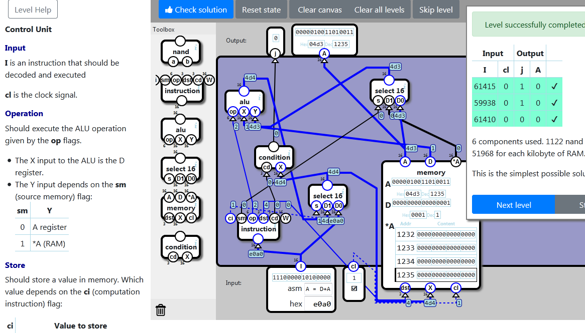

    localStorage["NandGame:Levels:EXECUTION_ENGINE"]="{\"nodes\":[{\"type\":\"CONDITION\",\"x\":76,\"y\":245,\"id\":\"0\"},{\"type\":\"INSTRUCTION_DECODER\",\"x\":42,\"y\":388,\"id\":\"1\"},{\"type\":\"SELECT16\",\"x\":183,\"y\":322,\"id\":\"2\"},{\"type\":\"STATE\",\"x\":329,\"y\":275,\"id\":\"3\"},{\"type\":\"ALU\",\"x\":17,\"y\":134,\"id\":\"4\"},{\"type\":\"SELECT16\",\"x\":306,\"y\":112,\"id\":\"5\"}],\"connections\":[{\"source\":{\"nodeId\":\"1\",\"connectorId\":\"4\"},\"target\":{\"nodeId\":\"0\",\"connectorId\":\"0\"}},{\"source\":{\"nodeId\":\"2\",\"connectorId\":\"0\"},\"target\":{\"nodeId\":\"0\",\"connectorId\":\"1\"}},{\"source\":{\"nodeId\":\"input\",\"connectorId\":\"0\"},\"target\":{\"nodeId\":\"1\",\"connectorId\":\"0\"}},{\"source\":{\"nodeId\":\"1\",\"connectorId\":\"0\"},\"target\":{\"nodeId\":\"2\",\"connectorId\":\"0\"}},{\"source\":{\"nodeId\":\"4\",\"connectorId\":\"0\"},\"target\":{\"nodeId\":\"2\",\"connectorId\":\"1\"}},{\"source\":{\"nodeId\":\"input\",\"connectorId\":\"0\"},\"target\":{\"nodeId\":\"2\",\"connectorId\":\"2\"}},{\"source\":{\"nodeId\":\"1\",\"connectorId\":\"3\"},\"target\":{\"nodeId\":\"3\",\"connectorId\":\"0\"}},{\"source\":{\"nodeId\":\"2\",\"connectorId\":\"0\"},\"target\":{\"nodeId\":\"3\",\"connectorId\":\"1\"}},{\"source\":{\"nodeId\":\"input\",\"connectorId\":\"1\"},\"target\":{\"nodeId\":\"3\",\"connectorId\":\"2\"}},{\"source\":{\"nodeId\":\"1\",\"connectorId\":\"2\"},\"target\":{\"nodeId\":\"4\",\"connectorId\":\"0\"}},{\"source\":{\"nodeId\":\"3\",\"connectorId\":\"1\"},\"target\":{\"nodeId\":\"4\",\"connectorId\":\"1\"}},{\"source\":{\"nodeId\":\"5\",\"connectorId\":\"0\"},\"target\":{\"nodeId\":\"4\",\"connectorId\":\"2\"}},{\"source\":{\"nodeId\":\"1\",\"connectorId\":\"1\"},\"target\":{\"nodeId\":\"5\",\"connectorId\":\"0\"}},{\"source\":{\"nodeId\":\"3\",\"connectorId\":\"2\"},\"target\":{\"nodeId\":\"5\",\"connectorId\":\"1\"}},{\"source\":{\"nodeId\":\"3\",\"connectorId\":\"0\"},\"target\":{\"nodeId\":\"5\",\"connectorId\":\"2\"}},{\"source\":{\"nodeId\":\"0\",\"connectorId\":\"0\"},\"target\":{\"nodeId\":\"output\",\"connectorId\":\"0\"}},{\"source\":{\"nodeId\":\"3\",\"connectorId\":\"0\"},\"target\":{\"nodeId\":\"output\",\"connectorId\":\"1\"}}]}"

