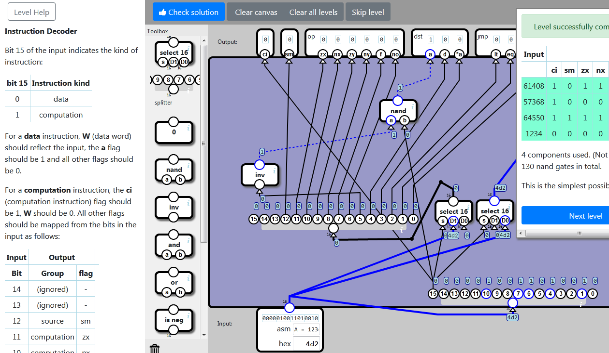

    localStorage["NandGame:Levels:INSTRUCTON_DECODER"]="{\"nodes\":[{\"type\":\"SELECT16\",\"x\":554,\"y\":363,\"id\":\"0\"},{\"type\":\"SPLIT16\",\"x\":482,\"y\":556,\"id\":\"1\"},{\"type\":\"SELECT16\",\"x\":469,\"y\":364,\"id\":\"2\"},{\"type\":\"SPLIT16\",\"x\":111,\"y\":401,\"id\":\"3\"},{\"type\":\"INV\",\"x\":68,\"y\":288,\"id\":\"4\"},{\"type\":\"NAND\",\"x\":354,\"y\":155,\"id\":\"5\"}],\"connections\":[{\"source\":{\"nodeId\":\"1\",\"connectorId\":\"0\"},\"target\":{\"nodeId\":\"0\",\"connectorId\":\"0\"}},{\"source\":{\"nodeId\":\"input\",\"connectorId\":\"0\"},\"target\":{\"nodeId\":\"0\",\"connectorId\":\"2\"}},{\"source\":{\"nodeId\":\"input\",\"connectorId\":\"0\"},\"target\":{\"nodeId\":\"1\",\"connectorId\":\"0\"}},{\"source\":{\"nodeId\":\"1\",\"connectorId\":\"0\"},\"target\":{\"nodeId\":\"2\",\"connectorId\":\"0\"}},{\"source\":{\"nodeId\":\"input\",\"connectorId\":\"0\"},\"target\":{\"nodeId\":\"2\",\"connectorId\":\"1\"}},{\"source\":{\"nodeId\":\"2\",\"connectorId\":\"0\"},\"target\":{\"nodeId\":\"3\",\"connectorId\":\"0\"},\"points\":[{\"x\":422,\"y\":445},{\"x\":482,\"y\":327}]},{\"source\":{\"nodeId\":\"3\",\"connectorId\":\"10\"},\"target\":{\"nodeId\":\"4\",\"connectorId\":\"0\"}},{\"source\":{\"nodeId\":\"4\",\"connectorId\":\"0\"},\"target\":{\"nodeId\":\"5\",\"connectorId\":\"0\"}},{\"source\":{\"nodeId\":\"1\",\"connectorId\":\"0\"},\"target\":{\"nodeId\":\"5\",\"connectorId\":\"1\"}},{\"source\":{\"nodeId\":\"1\",\"connectorId\":\"0\"},\"target\":{\"nodeId\":\"output\",\"connectorId\":\"0\"}},{\"source\":{\"nodeId\":\"3\",\"connectorId\":\"3\"},\"target\":{\"nodeId\":\"output\",\"connectorId\":\"1\"}},{\"source\":{\"nodeId\":\"3\",\"connectorId\":\"4\"},\"target\":{\"nodeId\":\"output\",\"connectorId\":\"2\"}},{\"source\":{\"nodeId\":\"3\",\"connectorId\":\"5\"},\"target\":{\"nodeId\":\"output\",\"connectorId\":\"3\"}},{\"source\":{\"nodeId\":\"3\",\"connectorId\":\"6\"},\"target\":{\"nodeId\":\"output\",\"connectorId\":\"4\"}},{\"source\":{\"nodeId\":\"3\",\"connectorId\":\"7\"},\"target\":{\"nodeId\":\"output\",\"connectorId\":\"5\"}},{\"source\":{\"nodeId\":\"3\",\"connectorId\":\"8\"},\"target\":{\"nodeId\":\"output\",\"connectorId\":\"6\"}},{\"source\":{\"nodeId\":\"3\",\"connectorId\":\"9\"},\"target\":{\"nodeId\":\"output\",\"connectorId\":\"7\"}},{\"source\":{\"nodeId\":\"5\",\"connectorId\":\"0\"},\"target\":{\"nodeId\":\"output\",\"connectorId\":\"8\"}},{\"source\":{\"nodeId\":\"3\",\"connectorId\":\"11\"},\"target\":{\"nodeId\":\"output\",\"connectorId\":\"9\"}},{\"source\":{\"nodeId\":\"3\",\"connectorId\":\"12\"},\"target\":{\"nodeId\":\"output\",\"connectorId\":\"10\"}},{\"source\":{\"nodeId\":\"3\",\"connectorId\":\"13\"},\"target\":{\"nodeId\":\"output\",\"connectorId\":\"11\"}},{\"source\":{\"nodeId\":\"3\",\"connectorId\":\"14\"},\"target\":{\"nodeId\":\"output\",\"connectorId\":\"12\"}},{\"source\":{\"nodeId\":\"3\",\"connectorId\":\"15\"},\"target\":{\"nodeId\":\"output\",\"connectorId\":\"13\"}},{\"source\":{\"nodeId\":\"0\",\"connectorId\":\"0\"},\"target\":{\"nodeId\":\"output\",\"connectorId\":\"14\"}}]}"

