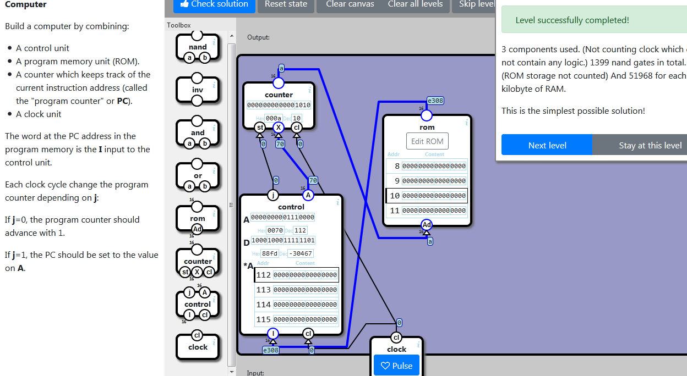

    localStorage["NandGame:Levels:IO2"]="{\"nodes\":[{\"type\":\"SPLIT16\",\"x\":72,\"y\":454.5,\"id\":\"0\"},{\"type\":\"AND\",\"x\":91,\"y\":520.5,\"id\":\"1\"},{\"type\":\"LAMP\",\"x\":279,\"y\":205,\"id\":\"2\"},{\"type\":\"AND\",\"x\":217,\"y\":319.5,\"id\":\"3\"},{\"type\":\"AND\",\"x\":312,\"y\":304.5,\"id\":\"4\"},{\"type\":\"BUNDLE16\",\"x\":74,\"y\":115,\"id\":\"5\"},{\"type\":\"BUTTON\",\"x\":15,\"y\":223,\"id\":\"6\"}],\"connections\":[{\"source\":{\"nodeId\":\"input\",\"connectorId\":\"1\"},\"target\":{\"nodeId\":\"0\",\"connectorId\":\"0\"}},{\"source\":{\"nodeId\":\"input\",\"connectorId\":\"0\"},\"target\":{\"nodeId\":\"1\",\"connectorId\":\"0\"}},{\"source\":{\"nodeId\":\"input\",\"connectorId\":\"2\"},\"target\":{\"nodeId\":\"1\",\"connectorId\":\"1\"}},{\"source\":{\"nodeId\":\"3\",\"connectorId\":\"0\"},\"target\":{\"nodeId\":\"2\",\"connectorId\":\"0\"}},{\"source\":{\"nodeId\":\"4\",\"connectorId\":\"0\"},\"target\":{\"nodeId\":\"2\",\"connectorId\":\"1\"}},{\"source\":{\"nodeId\":\"1\",\"connectorId\":\"0\"},\"target\":{\"nodeId\":\"3\",\"connectorId\":\"0\"}},{\"source\":{\"nodeId\":\"0\",\"connectorId\":\"14\"},\"target\":{\"nodeId\":\"3\",\"connectorId\":\"1\"}},{\"source\":{\"nodeId\":\"1\",\"connectorId\":\"0\"},\"target\":{\"nodeId\":\"4\",\"connectorId\":\"0\"}},{\"source\":{\"nodeId\":\"0\",\"connectorId\":\"15\"},\"target\":{\"nodeId\":\"4\",\"connectorId\":\"1\"}},{\"source\":{\"nodeId\":\"6\",\"connectorId\":\"0\"},\"target\":{\"nodeId\":\"5\",\"connectorId\":\"0\"}},{\"source\":{\"nodeId\":\"5\",\"connectorId\":\"0\"},\"target\":{\"nodeId\":\"output\",\"connectorId\":\"0\"}}]}"

