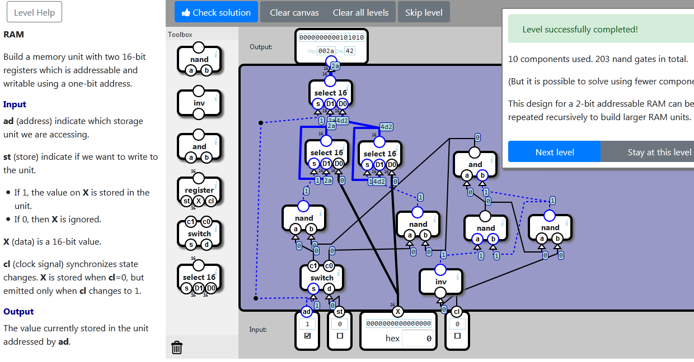

    localStorage["NandGame:Levels:RAM"]="{\"nodes\":[{\"type\":\"SELECT16\",\"x\":125,\"y\":94,\"id\":\"0\"},{\"type\":\"SELECT16\",\"x\":118,\"y\":201,\"id\":\"1\"},{\"type\":\"SELECT16\",\"x\":213,\"y\":203,\"id\":\"2\"},{\"type\":\"INV\",\"x\":322,\"y\":432,\"id\":\"3\"},{\"type\":\"NAND\",\"x\":402,\"y\":336,\"id\":\"4\"},{\"type\":\"NAND\",\"x\":517,\"y\":335,\"id\":\"5\"},{\"type\":\"NAND\",\"x\":77,\"y\":318,\"id\":\"6\"},{\"type\":\"NAND\",\"x\":281,\"y\":329,\"id\":\"7\"},{\"type\":\"DEMUX\",\"x\":109,\"y\":425,\"id\":\"8\"},{\"type\":\"AND\",\"x\":383,\"y\":222,\"id\":\"9\"}],\"connections\":[{\"source\":{\"nodeId\":\"input\",\"connectorId\":\"0\"},\"target\":{\"nodeId\":\"0\",\"connectorId\":\"0\"},\"points\":[{\"x\":40,\"y\":172},{\"x\":31,\"y\":486}]},{\"source\":{\"nodeId\":\"1\",\"connectorId\":\"0\"},\"target\":{\"nodeId\":\"0\",\"connectorId\":\"1\"}},{\"source\":{\"nodeId\":\"2\",\"connectorId\":\"0\"},\"target\":{\"nodeId\":\"0\",\"connectorId\":\"2\"}},{\"source\":{\"nodeId\":\"6\",\"connectorId\":\"0\"},\"target\":{\"nodeId\":\"1\",\"connectorId\":\"0\"}},{\"source\":{\"nodeId\":\"1\",\"connectorId\":\"0\"},\"target\":{\"nodeId\":\"1\",\"connectorId\":\"1\"}},{\"source\":{\"nodeId\":\"input\",\"connectorId\":\"2\"},\"target\":{\"nodeId\":\"1\",\"connectorId\":\"2\"}},{\"source\":{\"nodeId\":\"7\",\"connectorId\":\"0\"},\"target\":{\"nodeId\":\"2\",\"connectorId\":\"0\"}},{\"source\":{\"nodeId\":\"2\",\"connectorId\":\"0\"},\"target\":{\"nodeId\":\"2\",\"connectorId\":\"1\"}},{\"source\":{\"nodeId\":\"input\",\"connectorId\":\"2\"},\"target\":{\"nodeId\":\"2\",\"connectorId\":\"2\"}},{\"source\":{\"nodeId\":\"input\",\"connectorId\":\"3\"},\"target\":{\"nodeId\":\"3\",\"connectorId\":\"0\"}},{\"source\":{\"nodeId\":\"3\",\"connectorId\":\"0\"},\"target\":{\"nodeId\":\"4\",\"connectorId\":\"0\"}},{\"source\":{\"nodeId\":\"5\",\"connectorId\":\"0\"},\"target\":{\"nodeId\":\"4\",\"connectorId\":\"1\"}},{\"source\":{\"nodeId\":\"4\",\"connectorId\":\"0\"},\"target\":{\"nodeId\":\"5\",\"connectorId\":\"0\"}},{\"source\":{\"nodeId\":\"input\",\"connectorId\":\"3\"},\"target\":{\"nodeId\":\"5\",\"connectorId\":\"1\"}},{\"source\":{\"nodeId\":\"8\",\"connectorId\":\"0\"},\"target\":{\"nodeId\":\"6\",\"connectorId\":\"0\"}},{\"source\":{\"nodeId\":\"9\",\"connectorId\":\"0\"},\"target\":{\"nodeId\":\"6\",\"connectorId\":\"1\"}},{\"source\":{\"nodeId\":\"8\",\"connectorId\":\"1\"},\"target\":{\"nodeId\":\"7\",\"connectorId\":\"0\"}},{\"source\":{\"nodeId\":\"9\",\"connectorId\":\"0\"},\"target\":{\"nodeId\":\"7\",\"connectorId\":\"1\"}},{\"source\":{\"nodeId\":\"input\",\"connectorId\":\"0\"},\"target\":{\"nodeId\":\"8\",\"connectorId\":\"0\"}},{\"source\":{\"nodeId\":\"input\",\"connectorId\":\"1\"},\"target\":{\"nodeId\":\"8\",\"connectorId\":\"1\"}},{\"source\":{\"nodeId\":\"4\",\"connectorId\":\"0\"},\"target\":{\"nodeId\":\"9\",\"connectorId\":\"0\"}},{\"source\":{\"nodeId\":\"5\",\"connectorId\":\"0\"},\"target\":{\"nodeId\":\"9\",\"connectorId\":\"1\"}},{\"source\":{\"nodeId\":\"0\",\"connectorId\":\"0\"},\"target\":{\"nodeId\":\"output\",\"connectorId\":\"0\"}}]}"

