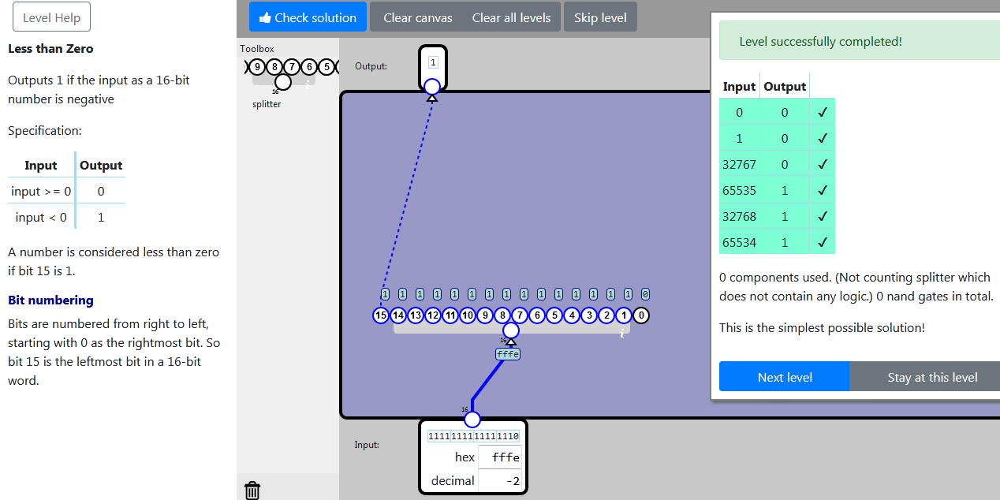

    localStorage["NandGame:Levels:SIGN"]="{\"nodes\":[{\"type\":\"SPLIT16\",\"x\":69,\"y\":349,\"id\":\"0\"}],\"connections\":[{\"source\":{\"nodeId\":\"input\",\"connectorId\":\"0\"},\"target\":{\"nodeId\":\"0\",\"connectorId\":\"0\"}},{\"source\":{\"nodeId\":\"0\",\"connectorId\":\"0\"},\"target\":{\"nodeId\":\"output\",\"connectorId\":\"0\"}}]}"

