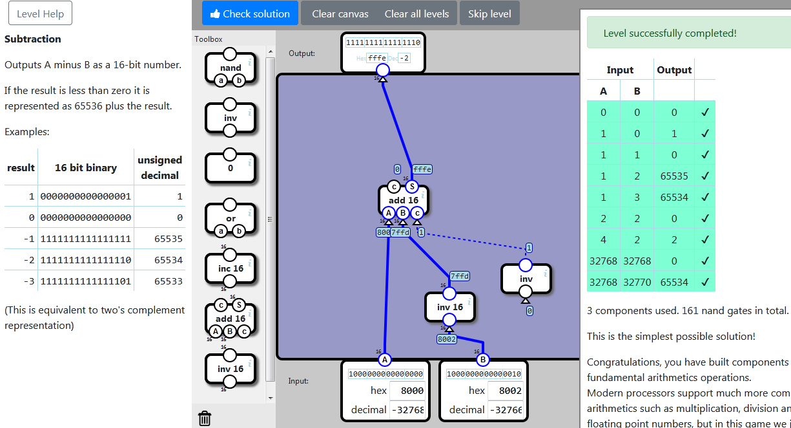

    localStorage["NandGame:Levels:SUB"]="{\"nodes\":[{\"type\":\"ADDC16\",\"x\":158,\"y\":240,\"id\":\"0\"},{\"type\":\"INV16\",\"x\":230,\"y\":406,\"id\":\"1\"},{\"type\":\"INV\",\"x\":348,\"y\":362,\"id\":\"2\"}],\"connections\":[{\"source\":{\"nodeId\":\"input\",\"connectorId\":\"0\"},\"target\":{\"nodeId\":\"0\",\"connectorId\":\"0\"}},{\"source\":{\"nodeId\":\"1\",\"connectorId\":\"0\"},\"target\":{\"nodeId\":\"0\",\"connectorId\":\"1\"}},{\"source\":{\"nodeId\":\"2\",\"connectorId\":\"0\"},\"target\":{\"nodeId\":\"0\",\"connectorId\":\"2\"}},{\"source\":{\"nodeId\":\"input\",\"connectorId\":\"1\"},\"target\":{\"nodeId\":\"1\",\"connectorId\":\"0\"}},{\"source\":{\"nodeId\":\"0\",\"connectorId\":\"1\"},\"target\":{\"nodeId\":\"output\",\"connectorId\":\"0\"}}]}"

